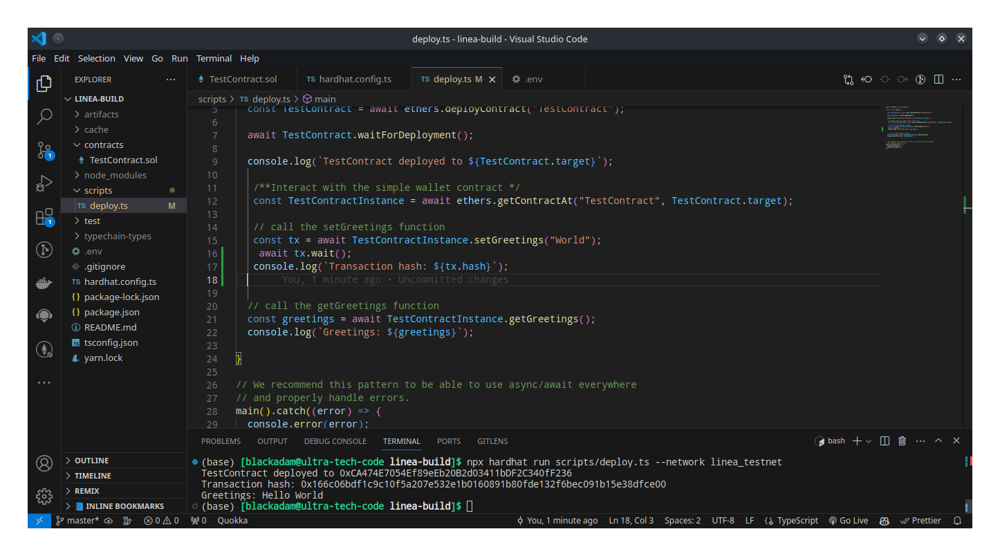
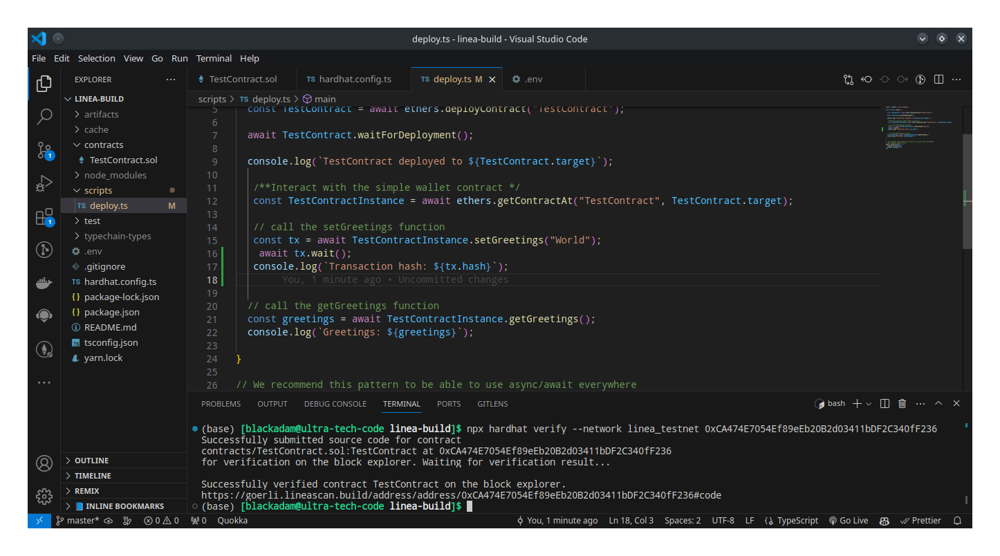

# how to build on linea with hardhat (testnet and mainnet)

---

## Table of Contents
- [how to build on linea with hardhat (testnet and mainnet)](#how-to-build-on-linea-with-hardhat-testnet-and-mainnet)
  - [Table of Contents](#table-of-contents)
  - [Introduction](#introduction)
  - [Objective](#objective)
  - [Prerequisites](#prerequisites)
  - [Requirements](#requirements)
  - [A brief intro to Linea](#a-brief-intro-to-linea)
    - [Benefits of Using Linea](#benefits-of-using-linea)
  - [Tutorial](#tutorial)
    - [Step 1 - Set Up Hardhat Environment](#step-1---set-up-hardhat-environment)
    - [Step 2 - Create Your Smart Contracts](#step-2---create-your-smart-contracts)
      - [TestContract Contract Explained](#testcontract-contract-explained)
    - [Step 3 - Deploying Your Contracts](#step-3---deploying-your-contracts)
      - [Metamask Installation \& Linea Goerli token minting](#metamask-installation--linea-goerli-token-minting)
    - [Step 4 - Verifying your contract](#step-4---verifying-your-contract)
    - [Conclusion](#conclusion)


## Introduction

Linea is a zero knowledge rollup chains


## Objective

By the end of this tutorial you should be able to write a contract and deploy it with create2 on the CELO blockchain.

## Prerequisites

- Understanding of [Solidity](https://soliditylang.org/): It is important to have a strong understanding of Solidity as it is the main programming language for creating smart contracts on the Celo blockchain.

- Command line proficiency: Basic familiarity with using command line tools such as the terminal or Command Prompt is necessary for running commands and scripts.

- Proficiency in [Hardhat](https://hardhat.org/): It is essential to have a good grasp of using Hardhat, a development environment designed for writing, testing, and deploying smart contracts on the Celo blockchain.

## Requirements

- A text editor: For this tutorial, we will make use of [Visual Studio Code](https://code.visualstudio.com/).
- You will need to have [Node.js](https://nodejs.org/en) installed on your system, with version V10. or higher.
- Node Package Manager [npm](https://docs.npmjs.com/downloading-and-installing-node-js-and-npm) used for installing and managing dependencies.
-  Install [MetaMask Wallet](https://metamask.io/download/).

## A brief intro to Linea
Linea is a fully EVM equivalent zero-knowledge rollup (zk-rollup), designed to scale Ethereum with higher throughput and lowered transaction fees.
An EVM-equivalent network, scaling the Ethereum experience. Secured with a zero-knowledge rollup to Ethereum, built on quantum-resistant, lattice-based cryptography, powered by Consensys.

Linea relies on an innovative, internally-built, lattice-powered prover which utilizes zkSNARK technology. It enables proofs to be generated quickly and yet does not require a trusted setup, which has long been a flaw of zkSNARK technology.

To read more on [zkevm](https://consensys.net/zkevm/) 


### Benefits of Using Linea

1. **Low gas fees:**  Build dApps that users can interact with at scale.

2. **EVM equivalent:** Fully compatible with existing tooling, infrastructure, IDEs and wallets.

3. **Secured by Ethereum:** Backed by the security of Ethereum, where all rollup transactions are verified on-chain by a decentralized community of over 500k validators.

4. **Next gen scalability:** Innovative lattice-based zkSNARK prover generates fast zero-knowledge proofs.

5. **Developer-friendly design:** Built to minimize onboarding time, the rollup abstracts away ZK complexity, uses ETH for gas and has no reliance on third party transpilers or bespoke middleware

## Tutorial

### Step 1 - Set Up Hardhat Environment

To begin setting up the Hardhat environment for your smart contract implementation, you will first need to create a new folder on your system. You can do this by using the `mkdir` command in your terminal followed by the desired name of your folder. For example:

```bash
mkdir build-on-linea
```

Next, navigate to your project folder using the `cd` command, like so:

```bash
cd build-on-linea
```

Once you have changed the directory into the folder, you can initialize a new npm project inside it by running the following command:

```bash
npm init
```

This will create a `package.json` file in your project folder with default settings.
Run the following command to initialize the Hardhat environment and create some default configuration files and folders required for building and testing smart contracts.

```bash
npm install --save-dev hardhat
npx npx hardhat
```

We will be using a TypeScript project for this tutorial, so click on “Create a typescript project” and enter this and other prompt options.
<br/>

Finally, open your project folder in VScode by running this command in your terminal:

```bash
code .
```

This will open up your project folder in Visual Studio Code, where you can start setting up your Hardhat environment and writing your smart contract code.
<br/>


### Step 2 - Create Your Smart Contracts

In the root directory of your project, you'll find a folder called "contracts". To create your smart contracts files, simply navigate to this folder and add your new files.
<br/>

For this tutorial, we'll need to To create this contract file:

- TestContract contract file

#### TestContract Contract Explained

```solidity
//SPDX-License-Identifier:MIT

pragma solidity ^0.8.19;

contract TestContract {
    string greetings;

    /**
     * @notice  . A function to set greetings name
     * @param   _name  . A string
    */
    function setGreetings(string memory _name) public {
        require(bytes(_name).length > 0, "Enter Valid Name");
        greetings = string(abi.encodePacked("Hello ", _name));
    }
    
    /**
     * @notice  . A function to return greetings value
    */
    function getGreetings() public view returns(string memory){
        return greetings;
    }   
}

```
The Breakdown of the contract:

- The License was specified
- The Solidity version was set
- The `setGreetings(string memory _name)`: sets the state variable greetings to user input `_name`.
  further breakdown of the function:
1. **bytes(_name)**: converts the variable `_name` (which is presumably a string) into a byte array. This conversion allows us to measure its length.

2. **bytes(_name).length**: calculates the length (number of bytes) of the converted string.

3. **require(..., "Enter Valid Name")** is a conditional statement. It checks whether the length of the byte array is greater than zero. If this condition is true, the code continues executing normally. If the condition is false (the length is not greater than zero), it will revert with the error message `"Enter Valid Name,"`and the execution of the contract will stop

3. **abi.encodePacked("Hello ", _name)**: Concatenates two strings together. It takes the string `Hello` and concatenates it with the value of the variable `_name`. The `abi.encodePacked` is a function that concatenates the input arguments and returns bytes without unnecessary padding or gas consumption.

4. **string(...)**: Converts the concatenated result into a Solidity string type. The result of `abi.encodePacked("Hello ", _name)` is a byte array, and this part of the code converts it into a string.

5. **greetings = ...**: The resulting string is assigned to the variable `greetings`.

- The `getGreetings()`: returns the value stored in the state variable greetings

### Step 3 - Deploying Your Contracts
Before deploying your contract to the Linea Goerli, ensure that you have added the Linea Goerli RPC to your wallet.

>**_Note_**: Linea comes with metamask directly so you don't need to import or configure your Metamask

We need Linea Goerli token to pay for gas when we deploy our contract on Linea Goerli.

#### Metamask Installation & Linea Goerli token minting

1. Install the [MetamaskWallet](https://chrome.google.com/webstore/detail/metamask/nkbihfbeogaeaoehlefnkodbefgpgknn) from the google chrome store.
2. Create a wallet.
3. Go to any of these website
[https://www.infura.io/faucet/linea] (https://www.infura.io/faucet/linea) 
[https://www.covalenthq.com/platform/faucet/] (https://www.covalenthq.com/platform/faucet/)
[https://linea.faucetme.pro/] (https://linea.faucetme.pro/)
and get tokens for the Linea Goerli.

You can also bridge your Goerli eth to Linea Goerli [here](https://bridge.linea.build/)
1. Connect your wallet in the top-right corner of the page.

2. Verify that the bridge is set to Ethereum → Linea Goerli, and that manual claiming is enabled.

3. Enter the amount of ETH you want to bridge over to Linea Goerli, and select the Start Bridging button.
>**_Note_**: check that your network is on testnet if you are bridging your testnet token.
<br/>

Next, add the Linea network configuration to the `hardhat.config.ts` file located in the root directory of your project. To enable the use of your private key for your Metamask account during contract deployment, you will need to install an env file. You can store your private key in the ".env" file and use the dotenv package to load it into your Hardhat configuration. Here is an example of how to configure it:

- Install the dotenv package:

```bash
npm install dotenv
```

- Create a `.env` file in the root directory of your project, paste your private key, INFURA_API_KEY, and `LINEASCAN_API_KEY` into it:

1. [To get your PRIVATE_KEY](https://support.metamask.io/hc/en-us/articles/360015289632-How-to-export-an-account-s-private-key)
2. [To get your INFURA_API_KEY](https://docs.infura.io/getting-started)
3. [To get your LINEASCAN_API_KEY](#verifying-your-contract)

```
PRIVATE_KEY = <your-private-key>
INFURA_API_KEY = <your-INFURA_API_KEY>
LINEASCAN_API_KEY = <LINEASCAN_API_KEY>
```

Here’s an example of how to add the Linea Goerli network configuration to your `hardhat.config.ts` file:

```typescript
import { HardhatUserConfig } from "hardhat/config";
import "@nomicfoundation/hardhat-toolbox";
require("dotenv").config();

let INFURA_API_KEY = process.env.INFURA_API_KEY
let PRIVATE_KEY = process.env.PRIVATE_KEY
let LINEASCAN_API_KEY = process.env.LINEASCAN_API_KEY

const config: HardhatUserConfig = {
  solidity: "0.8.19",
  networks: {
    linea_testnet: {
      url: `https://linea-goerli.infura.io/v3/${INFURA_API_KEY}`,
      accounts: [PRIVATE_KEY as string],
    },
    linea_mainnet: {
      url: `https://linea-mainnet.infura.io/v3/${INFURA_API_KEY}`,
      accounts: [PRIVATE_KEY as string],
    },
  },
  etherscan: {
    apiKey: {
      linea_testnet: LINEASCAN_API_KEY as string
    },
    customChains: [
      {
        network: "linea_testnet",
        chainId: 59140,
        urls: {
          apiURL: "https://api-testnet.lineascan.build/api",
          browserURL: "https://goerli.lineascan.build/address"
        }
      }
    ]
  }
};

export default config;

```

Next thing is to write our deploy scripts like so;

```typescript
import { ethers } from "hardhat";

async function main() {

  const TestContract = await ethers.deployContract("TestContract");

  await TestContract.waitForDeployment();

  console.log(`TestContract deployed to ${TestContract.target}`);

   /**Interact with the simple wallet contract */
   const TestContractInstance = await ethers.getContractAt("TestContract", TestContract.target);
   
   // call the setGreetings function
   const tx = await TestContractInstance.setGreetings("World");

  // call the getGreetings function
  const greetings = await TestContractInstance.getGreetings();
  console.log(`Greetings: ${greetings}`);

}

// We recommend this pattern to be able to use async/await everywhere
// and properly handle errors.
main().catch((error) => {
  console.error(error);
  process.exitCode = 1;
});

```

First, let's compile our smart contract using this command line in our VSCode terminal:

```bash
npx hardhat compile
```

>**_Note_**: Don't forget to delete the Lock.sol file as it would otherwise lead to an error when running the above command.

Then, let’s deploy our contract using this command line in our VSCode terminal:

```bash
npx hardhat run scripts/deploy.ts --network linea_testnet
```

The breakdown of the script:
- Deployed the TestContract contract and log the factory `contract address`
- Interacted with the `TestContract` contract passing in the deployed address.
- Called the `setGreetings` function and passed in a string to it.(i.e "World" in example)
- Called the `getGreetings` function to get the value.

You will discover that the `getGreetings` function returns `Hello World`
So, any thing we passed in to the `setGreetings` it's appended with `Hello` and the `getGreetings` function display it to us



Congratulations your contract has been successfullt deployed and you can start interacting with it.

### Step 4 - Verifying your contract
1. [sign up](https://lineascan.build/register)
2. confirm your email and sign in
3. click on your account dropdown and click on `API Keys` or [go to](https://lineascan.build/myapikey)
4. click on the add button and create an API key
5. copy the API key generated for you and add it to your env file

```
  LINEASCAN_API_KEY = <API-key-generated>
```

Next, let’s verify our contract using this command line in our VSCode terminal:

```bash
npx hardhat verify --network linea_testnet <DEPLOYED_CONTRACT_ADDRESS> 
```



### Conclusion

Therefore, deploying a contract with create2 on Celo allows you to pre-determine the contract's address before deploying it to the network, making it more efficient and cost-effective. This is achieved by calculating the address of the contract using the contract's bytecode, a salt value and the address of the creator account. By using create2, you can ensure that the contract address will be the same across different Ethereum-based networks, reducing the risk of errors or discrepancies. To deploy a contract with create2 on Celo, you can use the Celo SDK or web3.js library to interact with the Celo network and follow the specific steps outlined in the Celo documentation.

Hence, using create2 in Solidity provides several benefits to developers, including cost savings, improved user experience, contract upgradeability, and better security.
<br/>

The link to my project repository can be found [here](https://github.com/Ultra-Tech-code/Deployment-with-create2).

